# Database overview

The schema is PostgreSQL-first and is defined in `prisma/schema.prisma`. All
timestamps are UTC, money is stored as integer minor units, and translations
use `(entity_id, locale)` unique constraints.

```mermaid
erDiagram
  ADMIN_USER ||--o{ ADMIN_SESSION : owns
  ADMIN_USER ||--o{ USER_ROLE : receives
  ROLE ||--o{ USER_ROLE : grants
  ROLE ||--o{ ROLE_PERMISSION : contains
  PERMISSION ||--o{ ROLE_PERMISSION : defines
  ADMIN_USER ||--o{ AUDIT_LOG : creates
  EVENT ||--o{ EVENT_TRANSLATION : translates
  EVENT ||--o{ EVENT_ARTIST : books
  ARTIST ||--o{ ARTIST_TRANSLATION : translates
  EVENT ||--o{ TICKET_TIER : sells
  EVENT ||--o{ VIP_PACKAGE : offers
  VIP_PACKAGE ||--o{ VIP_PACKAGE_BOTTLE : includes
  BOTTLE_OPTION ||--o{ VIP_PACKAGE_BOTTLE : selected
  EVENT ||--o{ BOOKING_REQUEST : receives
  PRODUCT ||--o{ PRODUCT_TRANSLATION : translates
  PRODUCT ||--o{ PRODUCT_IMAGE : shows
  PRODUCT ||--o{ PRODUCT_VARIANT : varies
  PRODUCT ||--o{ ORDER_ITEM : ordered
  ORDER ||--o{ ORDER_ITEM : contains
  ORDER ||--o{ CHECKOUT_SESSION : starts
  ORDER ||--o{ PAYMENT : records
  NEWS_ARTICLE ||--o{ NEWS_TRANSLATION : translates
  GALLERY_ALBUM ||--o{ GALLERY_TRANSLATION : translates
  GALLERY_ALBUM ||--o{ GALLERY_MEDIA : contains
  FAQ_ITEM ||--o{ FAQ_TRANSLATION : translates
  LEGAL_DOCUMENT ||--o{ LEGAL_TRANSLATION : translates
  PARTNER ||--o{ PARTNER_TRANSLATION : translates
  MEDIA_ASSET ||--o{ PRODUCT_IMAGE : references
  MEDIA_ASSET ||--o{ GALLERY_MEDIA : references
```

See the migration history under `prisma/migrations/` for the deployable
database state.
